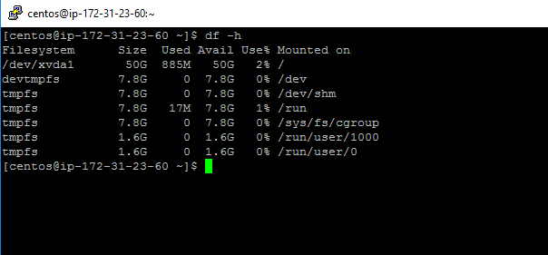
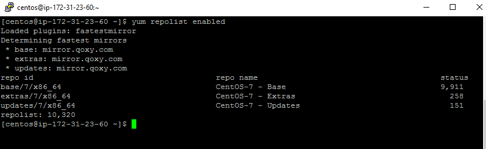
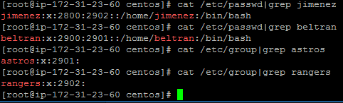

# Challenge Setup

Setup Details

Cloud Provider | AWS
-|-
OS | CentOS Linux 7 x86_64 HVM EBS ENA 1803_01

Instances Details

Instance ID         | DNS Name                                                | Public IP      | Private IP    | Role
--------------------|---------------------------------------------------------|----------------|---------------|--------
i-00cd75d2fbcf3626f | ec2-54-169-158-182.ap-southeast-1.compute.amazonaws.com | 54.169.158.182 | 172.31.23.60  | CM, MariaDB
i-0211c7565e7ac1323 | ec2-13-250-1-59.ap-southeast-1.compute.amazonaws.com    | 13.250.1.59    | 172.31.31.148 | Master
i-025142e4e2aa525ab | ec2-54-169-40-156.ap-southeast-1.compute.amazonaws.com  | 54.169.40.156  | 172.31.20.239 | Secondary, Data
i-0b56c87a3ea7760a8 | ec2-54-251-159-238.ap-southeast-1.compute.amazonaws.com | 54.251.159.238 | 172.31.24.170 | Data
i-0e5bf4c4d3e9c43a6 | ec2-54-255-236-2.ap-southeast-1.compute.amazonaws.com   | 54.255.236.2   | 172.31.16.210 | Data

File capacity for one of the instances

Output for yum repolist enabled

User accounts

