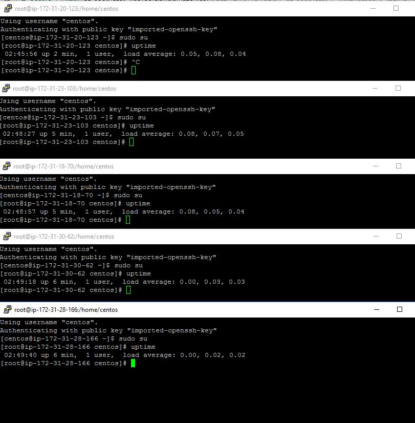
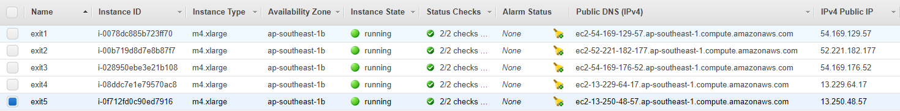
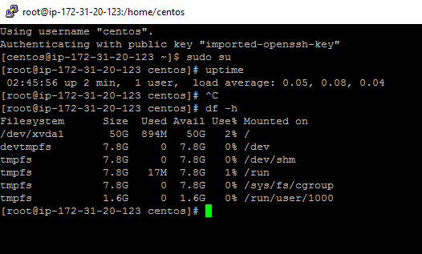
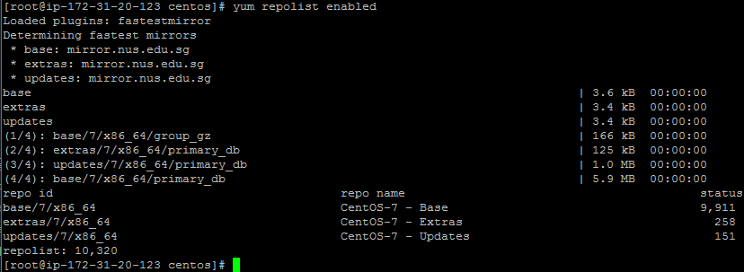
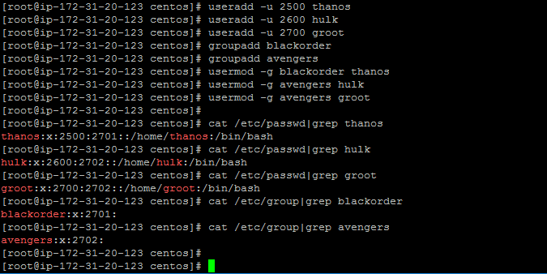

# Challenge Setup

1. Uptime of all the nodes:

2. Cloud Provider : AWS

3. IP Address and DNS names:

3. Linux : CentOS Linux 7 x86_64 HVM EBS ENA 1803_01

4. File Capacity of first node:

5. yum repolist enabled for first node:

6. User and group listing

