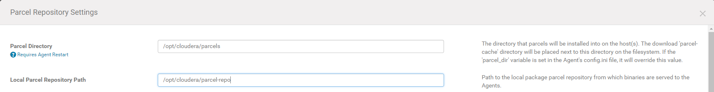

# Challenge 3 - Install CDH 5.11.2.4

1. Local repo directory

2. Output for hdfs dfs -ls /user

[root@ip-172-31-23-103 ~]# hdfs dfs -ls /user
Found 7 items
drwxr-xr-x   - groot  avengers            0 2018-05-18 04:34 /user/groot
drwxrwxrwx   - mapred hadoop              0 2018-05-18 04:18 /user/history
drwxrwxr-t   - hive   hive                0 2018-05-18 04:18 /user/hive
drwxrwxr-x   - hue    hue                 0 2018-05-18 04:19 /user/hue
drwxr-xr-x   - hulk   avengers            0 2018-05-18 04:34 /user/hulk
drwxrwxr-x   - oozie  oozie               0 2018-05-18 04:19 /user/oozie
drwxr-xr-x   - thanos blackorder          0 2018-05-18 04:34 /user/thanos
[root@ip-172-31-23-103 ~]#

3. /api/v5/hosts

<code>
{
items: [
{
hostId: "504eb6c1-b9a8-40f1-a122-dacc39c122f1",
ipAddress: "172.31.18.70",
hostname: "ip-172-31-18-70.ap-southeast-1.compute.internal",
rackId: "/default",
hostUrl: "http://ip-172-31-23-103.ap-southeast-1.compute.internal:7180/cmf/hostRedirect/504eb6c1-b9a8-40f1-a122-dacc39c122f1",
maintenanceMode: false,
maintenanceOwners: [ ],
commissionState: "COMMISSIONED",
numCores: 4,
totalPhysMemBytes: 16656265216
},
{
hostId: "fb31ca5c-ad3c-4ae9-8edf-abcd3712b9f4",
ipAddress: "172.31.20.123",
hostname: "ip-172-31-20-123.ap-southeast-1.compute.internal",
rackId: "/default",
hostUrl: "http://ip-172-31-23-103.ap-southeast-1.compute.internal:7180/cmf/hostRedirect/fb31ca5c-ad3c-4ae9-8edf-abcd3712b9f4",
maintenanceMode: false,
maintenanceOwners: [ ],
commissionState: "COMMISSIONED",
numCores: 4,
totalPhysMemBytes: 16656265216
},
{
hostId: "7e9a9edf-c480-4b46-a1f3-cb95cd0dfdd3",
ipAddress: "172.31.23.103",
hostname: "ip-172-31-23-103.ap-southeast-1.compute.internal",
rackId: "/default",
hostUrl: "http://ip-172-31-23-103.ap-southeast-1.compute.internal:7180/cmf/hostRedirect/7e9a9edf-c480-4b46-a1f3-cb95cd0dfdd3",
maintenanceMode: false,
maintenanceOwners: [ ],
commissionState: "COMMISSIONED",
numCores: 4,
totalPhysMemBytes: 16656265216
},
{
hostId: "d78f4603-2224-4773-a197-bc49902e9989",
ipAddress: "172.31.28.166",
hostname: "ip-172-31-28-166.ap-southeast-1.compute.internal",
rackId: "/default",
hostUrl: "http://ip-172-31-23-103.ap-southeast-1.compute.internal:7180/cmf/hostRedirect/d78f4603-2224-4773-a197-bc49902e9989",
maintenanceMode: false,
maintenanceOwners: [ ],
commissionState: "COMMISSIONED",
numCores: 4,
totalPhysMemBytes: 16656007168
},
{
hostId: "c1ad2091-3c96-400b-b734-d04647defc40",
ipAddress: "172.31.30.62",
hostname: "ip-172-31-30-62.ap-southeast-1.compute.internal",
rackId: "/default",
hostUrl: "http://ip-172-31-23-103.ap-southeast-1.compute.internal:7180/cmf/hostRedirect/c1ad2091-3c96-400b-b734-d04647defc40",
maintenanceMode: false,
maintenanceOwners: [ ],
commissionState: "COMMISSIONED",
numCores: 4,
totalPhysMemBytes: 16656265216
}
]
}
</code>

4. /api/v11/clusters/vicngdeloitte/services

<code>
{
items: [
{
name: "hive",
type: "HIVE",
clusterRef: {
clusterName: "cluster"
},
serviceUrl: "http://ip-172-31-23-103.ap-southeast-1.compute.internal:7180/cmf/serviceRedirect/hive",
roleInstancesUrl: "http://ip-172-31-23-103.ap-southeast-1.compute.internal:7180/cmf/serviceRedirect/hive/instances",
serviceState: "STARTED",
healthSummary: "GOOD",
healthChecks: [
{
name: "HIVE_HIVEMETASTORES_HEALTHY",
summary: "GOOD",
suppressed: false
},
{
name: "HIVE_HIVESERVER2S_HEALTHY",
summary: "GOOD",
suppressed: false
}
],
configStalenessStatus: "FRESH",
clientConfigStalenessStatus: "FRESH",
maintenanceMode: false,
maintenanceOwners: [ ],
displayName: "Hive",
entityStatus: "GOOD_HEALTH"
},
{
name: "hbase",
type: "HBASE",
clusterRef: {
clusterName: "cluster"
},
serviceUrl: "http://ip-172-31-23-103.ap-southeast-1.compute.internal:7180/cmf/serviceRedirect/hbase",
roleInstancesUrl: "http://ip-172-31-23-103.ap-southeast-1.compute.internal:7180/cmf/serviceRedirect/hbase/instances",
serviceState: "STARTED",
healthSummary: "GOOD",
healthChecks: [
{
name: "HBASE_MASTER_HEALTH",
summary: "GOOD",
suppressed: false
},
{
name: "HBASE_REGION_SERVERS_HEALTHY",
summary: "GOOD",
suppressed: false
}
],
configStalenessStatus: "FRESH",
clientConfigStalenessStatus: "FRESH",
maintenanceMode: false,
maintenanceOwners: [ ],
displayName: "HBase",
entityStatus: "GOOD_HEALTH"
},
{
name: "zookeeper",
type: "ZOOKEEPER",
clusterRef: {
clusterName: "cluster"
},
serviceUrl: "http://ip-172-31-23-103.ap-southeast-1.compute.internal:7180/cmf/serviceRedirect/zookeeper",
roleInstancesUrl: "http://ip-172-31-23-103.ap-southeast-1.compute.internal:7180/cmf/serviceRedirect/zookeeper/instances",
serviceState: "STARTED",
healthSummary: "GOOD",
healthChecks: [
{
name: "ZOOKEEPER_CANARY_HEALTH",
summary: "GOOD",
suppressed: false
},
{
name: "ZOOKEEPER_SERVERS_HEALTHY",
summary: "GOOD",
suppressed: false
}
],
configStalenessStatus: "FRESH",
clientConfigStalenessStatus: "FRESH",
maintenanceMode: false,
maintenanceOwners: [ ],
displayName: "ZooKeeper",
entityStatus: "GOOD_HEALTH"
},
{
name: "hue",
type: "HUE",
clusterRef: {
clusterName: "cluster"
},
serviceUrl: "http://ip-172-31-23-103.ap-southeast-1.compute.internal:7180/cmf/serviceRedirect/hue",
roleInstancesUrl: "http://ip-172-31-23-103.ap-southeast-1.compute.internal:7180/cmf/serviceRedirect/hue/instances",
serviceState: "STARTED",
healthSummary: "GOOD",
healthChecks: [
{
name: "HUE_HUE_SERVERS_HEALTHY",
summary: "GOOD",
suppressed: false
}
],
configStalenessStatus: "FRESH",
clientConfigStalenessStatus: "FRESH",
maintenanceMode: false,
maintenanceOwners: [ ],
displayName: "Hue",
entityStatus: "GOOD_HEALTH"
},
{
name: "oozie",
type: "OOZIE",
clusterRef: {
clusterName: "cluster"
},
serviceUrl: "http://ip-172-31-23-103.ap-southeast-1.compute.internal:7180/cmf/serviceRedirect/oozie",
roleInstancesUrl: "http://ip-172-31-23-103.ap-southeast-1.compute.internal:7180/cmf/serviceRedirect/oozie/instances",
serviceState: "STARTED",
healthSummary: "GOOD",
healthChecks: [
{
name: "OOZIE_OOZIE_SERVERS_HEALTHY",
summary: "GOOD",
suppressed: false
}
],
configStalenessStatus: "FRESH",
clientConfigStalenessStatus: "FRESH",
maintenanceMode: false,
maintenanceOwners: [ ],
displayName: "Oozie",
entityStatus: "GOOD_HEALTH"
},
{
name: "yarn",
type: "YARN",
clusterRef: {
clusterName: "cluster"
},
serviceUrl: "http://ip-172-31-23-103.ap-southeast-1.compute.internal:7180/cmf/serviceRedirect/yarn",
roleInstancesUrl: "http://ip-172-31-23-103.ap-southeast-1.compute.internal:7180/cmf/serviceRedirect/yarn/instances",
serviceState: "STARTED",
healthSummary: "GOOD",
healthChecks: [
{
name: "YARN_JOBHISTORY_HEALTH",
summary: "GOOD",
suppressed: false
},
{
name: "YARN_NODE_MANAGERS_HEALTHY",
summary: "GOOD",
suppressed: false
},
{
name: "YARN_RESOURCEMANAGERS_HEALTH",
summary: "GOOD",
suppressed: false
},
{
name: "YARN_USAGE_AGGREGATION_HEALTH",
summary: "DISABLED",
suppressed: false
}
],
configStalenessStatus: "FRESH",
clientConfigStalenessStatus: "FRESH",
maintenanceMode: false,
maintenanceOwners: [ ],
displayName: "YARN (MR2 Included)",
entityStatus: "GOOD_HEALTH"
},
{
name: "hdfs",
type: "HDFS",
clusterRef: {
clusterName: "cluster"
},
serviceUrl: "http://ip-172-31-23-103.ap-southeast-1.compute.internal:7180/cmf/serviceRedirect/hdfs",
roleInstancesUrl: "http://ip-172-31-23-103.ap-southeast-1.compute.internal:7180/cmf/serviceRedirect/hdfs/instances",
serviceState: "STARTED",
healthSummary: "GOOD",
healthChecks: [
{
name: "HDFS_BLOCKS_WITH_CORRUPT_REPLICAS",
summary: "GOOD",
suppressed: false
},
{
name: "HDFS_CANARY_HEALTH",
summary: "GOOD",
suppressed: false
},
{
name: "HDFS_DATA_NODES_HEALTHY",
summary: "GOOD",
suppressed: false
},
{
name: "HDFS_FREE_SPACE_REMAINING",
summary: "GOOD",
suppressed: false
},
{
name: "HDFS_HA_NAMENODE_HEALTH",
summary: "GOOD",
suppressed: false
},
{
name: "HDFS_MISSING_BLOCKS",
summary: "GOOD",
suppressed: false
},
{
name: "HDFS_UNDER_REPLICATED_BLOCKS",
summary: "GOOD",
suppressed: false
}
],
configStalenessStatus: "FRESH",
clientConfigStalenessStatus: "FRESH",
maintenanceMode: false,
maintenanceOwners: [ ],
displayName: "HDFS",
entityStatus: "GOOD_HEALTH"
}
]
}
</code>
