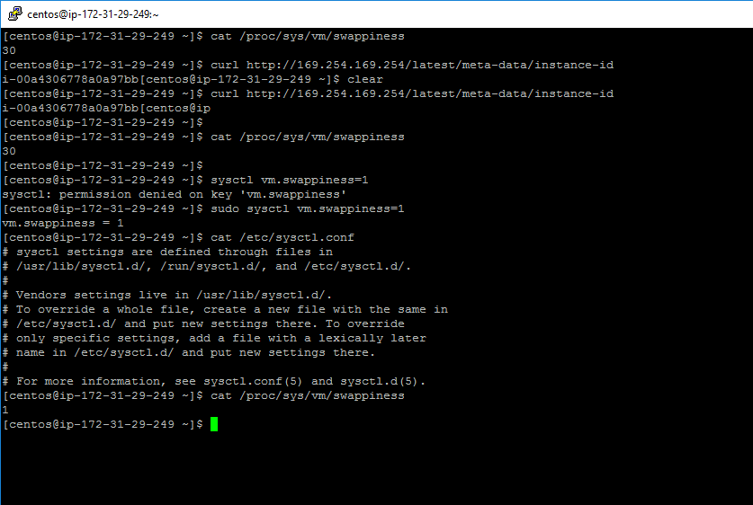

# Lab 1 : Installation
## System Configuration Checks

Below are 5 instances created in AWS and the designated role:

Instance ID         |	Public DNS                                              | Private DNS                                       | Role
--------------------|---------------------------------------------------------|---------------------------------------------------|--------------------------------------------------------------
i-00a4306778a0a97bb | ec2-13-229-134-99.ap-southeast-1.compute.amazonaws.com	| ip-172-31-29-249.ap-southeast-1.compute.internal	| MariaDB, CM, Hue, Oozie, Hive, Zookeeper, Management Services
i-0419d1b444f35630d	| ec2-52-77-229-192.ap-southeast-1.compute.amazonaws.com	| ip-172-31-16-143.ap-southeast-1.compute.internal	| Primary NameNode, Resource Manager, Job History, Zookeeper, DataNode, Node Manager
i-0cdd0fd040de57507	| ec2-54-179-173-164.ap-southeast-1.compute.amazonaws.com	| ip-172-31-25-222.ap-southeast-1.compute.internal	| Secondary NameNode, Zookeeper, DataNode, Node Manager
i-05ac92dc9e2d591fd	| ec2-13-229-131-107.ap-southeast-1.compute.amazonaws.com	| ip-172-31-29-124.ap-southeast-1.compute.internal	| DataNode, Node Manager
i-08354488aa58304d6	| ec2-13-250-42-125.ap-southeast-1.compute.amazonaws.com	| ip-172-31-30-14.ap-southeast-1.compute.internal	  | DataNode, Node Manager

### Swappiness configuration

After modifying swappiness and rebooting

Instructions based on this link:
https://unix.stackexchange.com/questions/265713/how-to-configure-swappiness-in-linux-memory-management

### Checking the mount attributes

### Disable transparent hugepage
Checking the THP before modifying

Checking the THP after rebooting

Instructions based on this link:
https://blacksaildivision.com/how-to-disable-transparent-huge-pages-on-centos

### Checking the network config

### nslookup and reverse nslookup

Install nslookup : <code>yum install bind-utils</code>

### nscd service
Install nscd : <code>yum install nscd</code>

Instructions based on this link:
http://www.unixmantra.com/2014/07/how-to-enable-name-service-cache-daemon-nscd.html

### ntpd service

Instructions based on this link:
https://www.tecmint.com/install-ntp-server-in-centos/

## Installing CM
1. Download repo file from cloudera
2. Install JDK from Cloudera repo
3. Install Cloudera Manager from Cloudera Repo
4. Run schema script for each database
https://www.cloudera.com/documentation/enterprise/latest/topics/cm_ig_installing_configuring_dbs.html#concept_i2r_m3m_hn
5. Start Cloudera Manager
<code>service cloudera-scm-server start</code>

## Troubleshooting CDH

1. Encountered Inspector Host error.
Solution: Allowed port 9000 in firewall to resolve it. http://community.cloudera.com/t5/Cloudera-Manager-Installation/Cluster-installation-The-inspector-failed-to-run-on-all-hosts/td-p/2923

2. Encountered Zookeeper start up failure:

<code>
Invalid config, exiting abnormally
org.apache.zookeeper.server.quorum.QuorumPeerConfig$ConfigException: Error processing /run/cloudera-scm-agent/process/60-zookeeper-server/zoo.cfg
at org.apache.zookeeper.server.quorum.QuorumPeerConfig.parse(QuorumPeerConfig.java:131)
at org.apache.zookeeper.server.quorum.QuorumPeerMain.initializeAndRun(QuorumPeerMain.java:106)
at org.apache.zookeeper.server.quorum.QuorumPeerMain.main(QuorumPeerMain.java:79)
Caused by: java.lang.IllegalArgumentException: /var/lib/zookeeper/myid file is missingInvalid config
</code>

Solution: Manually created /var/lib/zookeeper/myid

3. Encountered permission lock issue with yarn
<code>
org.apache.hadoop.service.ServiceStateException: org.fusesource.leveldbjni.internal.NativeDB$DBException: IO error: /var/lib/hadoop-yarn/yarn-nm-recovery/yarn-nm-state/LOCK: Permission
</code>
Solution:
<code>
chown yarn.hadoop /var/lib/hadoop-yarn
chmod 755 /var/lib/hadoop-yarn
</code>

Final solution: Turn on all TCP ports for Security group. However, this is not the ideal solution as it is risky.

## Completed screen

