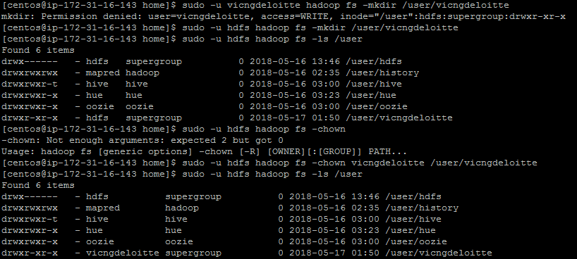
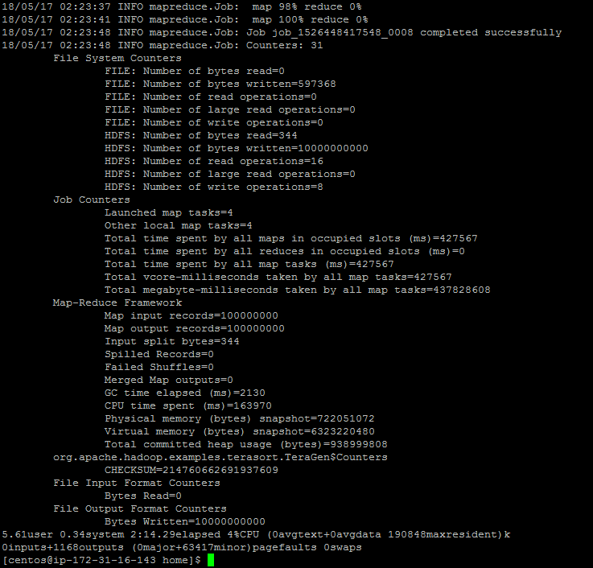
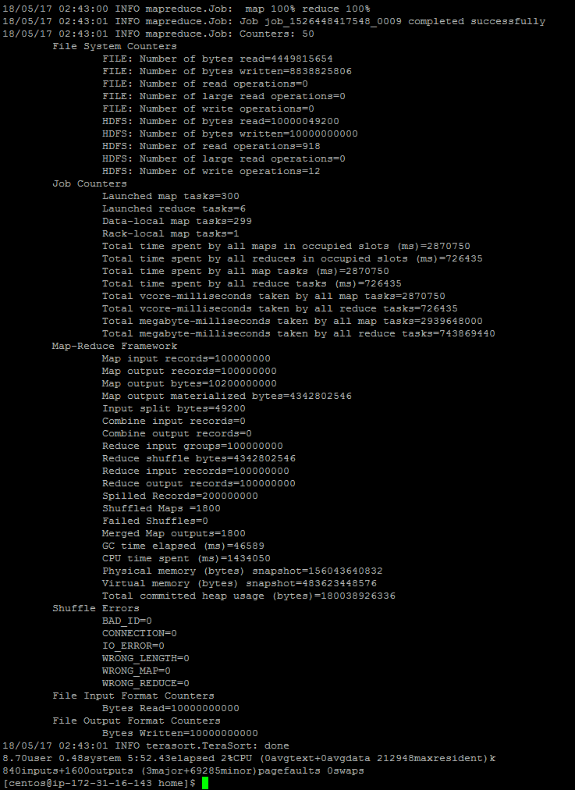

# HDFS Lab: Test HDFS throughput

1. Create an end-user Linux account named with your GitHub handle:

<code>sudo useradd -m vicngdeloitte</code>

2. Create HDFS directory under user

3. Generate 10GB file using teragen

<code>[centos@ip-172-31-16-143 home]$ sudo -u vicngdeloitte time hadoop jar /opt/cloudera/parcels/CDH-5.14.2-1.cdh5.14.2.p0.3/jars/hadoop-examples.jar teragen -Dmapreduce.job.maps=4 -Ddfs.blocksize=33554432 100000000 /user/vicngdeloitte/output</code>

Timing:

4. Use terasort

<code>[centos@ip-172-31-16-143 home]$ sudo -u vicngdeloitte time hadoop jar /opt/cloudera/parcels/CDH-5.14.2-1.cdh5.14.2.p0.3/jars/hadoop-examples.jar terasort /user/vicngdeloitte/output /user/vicngdeloitte/sorted
</code>

Timing:

